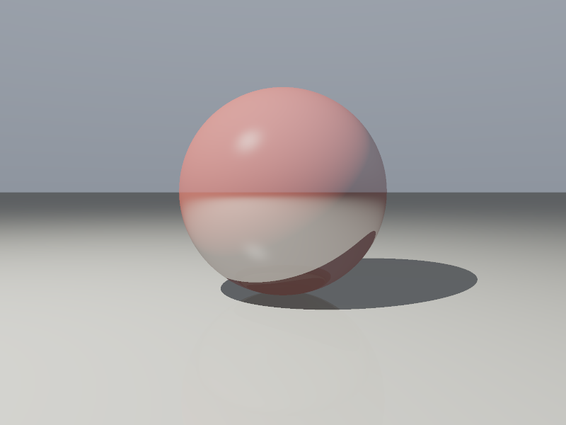
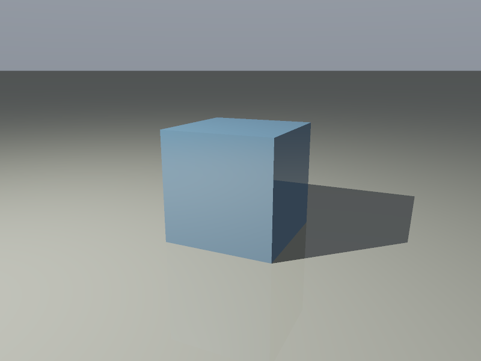
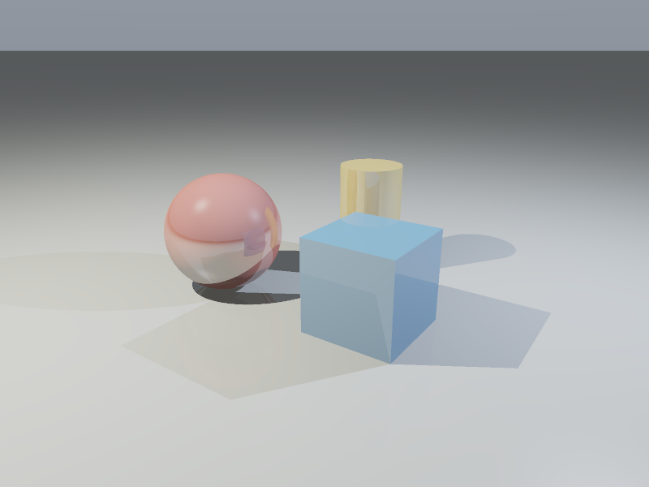
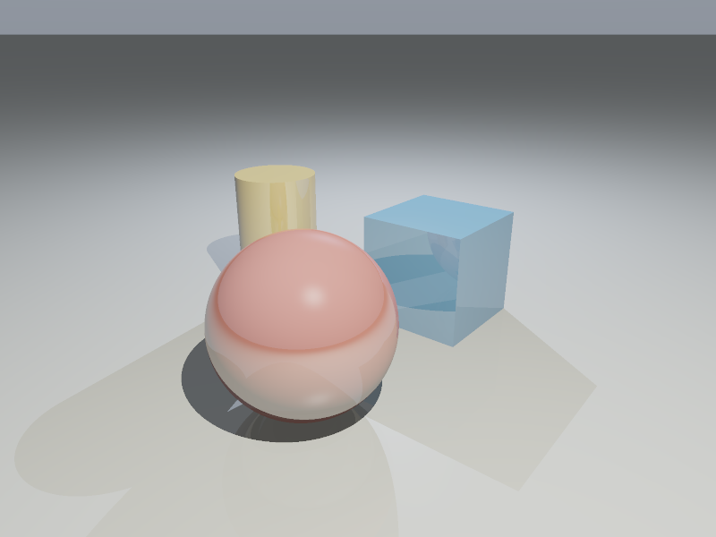

# RT: Rust Ray Tracer — usage and scene authoring

See [README.md](README.md) for setup, the CLI reference, implementation overview, performance measurements, and limitations. The executable is named `rt`; the project title is **RT: Rust Ray Tracer**.

## Authoring objects

Scene presets live in `src/scene.rs`. Their `Scene::objects` vectors contain the four basic `Object` variants. The following snippets belong inside the scene factory or another function in that module. They use the existing `Vec3`, `Object`, and `material` imports/helper; this project is a binary, not a public library crate.

### Sphere

```rust
let sphere = Object::Sphere {
    center: Vec3::new(1.0, 1.0, 1.0),
    radius: 1.0,
    material: material(Vec3::new(0.95, 0.18, 0.14), 0.35),
};
```

`center` locates the sphere; `radius` must be positive. Moving `center` moves the object without changing its size.

### Cube

```rust
let cube = Object::Cube {
    min: Vec3::new(-0.8, -0.55, -0.8),
    max: Vec3::new(0.8, 1.05, 0.8),
    material: material(Vec3::new(0.15, 0.43, 0.82), 0.18),
};
```

The bounds are aligned with the world axes. Each `min` coordinate must be below the corresponding `max` coordinate. Equal extents form a cube; unequal extents form a rectangular box. Add the same displacement to both corners to move the object.

### Plane

```rust
let plane = Object::Plane {
    point: Vec3::new(0.0, 0.0, 0.0),
    normal: Vec3::new(0.0, 1.0, 0.0),
    material: material(Vec3::new(0.72, 0.74, 0.70), 0.12),
};
```

`point` is any point on the infinite plane. The nonzero `normal` determines orientation and is normalized during intersection. Change the point to translate the plane and its normal to tilt it. The shader supports viewing either side.

### Cylinder

```rust
let cylinder = Object::Cylinder {
    center: Vec3::new(0.0, 0.05, -1.55),
    radius: 0.45,
    height: 1.6,
    material: material(Vec3::new(0.91, 0.68, 0.20), 0.24),
};
```

The cylinder is vertical, centered at `center`, with positive radius and height. Its caps lie at `center.y ± height / 2`. Both caps and the curved side participate in intersections, shadows, and reflections.

Use finite coordinates, RGB components in `0.0..=1.0`, reflectivity and transmission in `0.0..=1.0`, and positive refractive indices. Source-authored geometry is trusted; the CLI validates external parameters, not arbitrary Rust scene definitions.

## Materials and textures

`material(color, reflectivity)` creates an opaque material with IOR 1.5 and a default checker texture whose alternate color is 30% of its base color. Texture rendering requires `--textures`; reflection requires `--reflections`.

Customize a material before assigning it to an object:

```rust
let mut surface = material(Vec3::new(0.8, 0.8, 0.8), 0.2);
surface.texture = Some(Checker {
    alternate: Vec3::new(0.1, 0.15, 0.2),
    scale: 2.0,
});
```

Positive `scale` controls checker frequency; `2.0` creates half-unit cells. The pattern uses the parity of the sum of the floored scaled world coordinates, so it applies to curved surfaces as well as flat faces, including negative coordinates. Patterns are anchored in world space, not attached UV coordinates. Set `surface.texture = None` for a uniform surface.

For custom glass:

```rust
let mut glass = material(Vec3::new(0.94, 0.98, 1.0), 0.0);
glass.transmission = 0.92;
glass.ior = 1.5;
glass.texture = None;
```

Assign `glass` to a sphere or another closed primitive and enable `--refractions`. The command also converts the spheres in built-in presets to glass; particle droplets keep their blue opaque material. Transmissive surfaces include their Fresnel reflection even when `--reflections` is off. For opaque materials, reflections remain a separate opt-in flag.

Refraction uses Snell's law and total internal reflection with Schlick's approximation for the reflected/transmitted mix. The renderer assumes air outside each dielectric. It does not track nested media or solve caustics. For background on the underlying optics, see [PBRT: Specular Reflection and Transmission](https://www.pbr-book.org/4ed/Reflection_Models/Specular_Reflection_and_Transmission).

## Brightness and lights

Scene lights are point lights:

```rust
Light {
    position: Vec3::new(-3.0, 5.5, 3.0),
    color: Vec3::new(1.0, 0.96, 0.88),
    brightness: 5.5,
}
```

Change `position` to move a light, `color` to change its tint, and its nonnegative `brightness` to change strength. The attenuation function is `1 / (1 + 0.025 * distance²)`, an artistic falloff rather than physical inverse-square lighting. `Scene::ambient` adds a constant ambient contribution, so brightness zero does not produce an entirely black scene.

Override preset brightness without editing source:

```sh
cargo run --release -- --scene cube-plane --brightness 2.4 --output dim.ppm
```

The `all` scenes contain two lights. The override sets the first light's brightness; the second remains 65% of that value. The `sphere` preset uses 5.5 and `cube-plane` uses 3.0 by default.

## Camera position and angle

`Camera::look_at` returns a `Result` to report invalid camera inputs. Inside the scene factory, propagate that result with `?`:

```rust
let camera = Camera::look_at(
    Vec3::new(3.7, 2.4, 5.0),     // position
    Vec3::new(0.0, 0.0, -0.35),   // look-at target
    Vec3::new(0.0, 1.0, 0.0),     // preferred up axis
    50.0,                         // vertical field of view in degrees
)?;
```

Change position to move the camera, target to aim it, and field of view to widen or narrow the view. Coincident positions are rejected; a parallel preferred up axis is replaced with another axis to avoid a degenerate camera basis.

```sh
cargo run --release -- --scene all --camera -4.4,2.3,3.2 --output alternate.ppm
cargo run --release -- --scene all --camera 3.7,2.4,5 --target 0,0,-0.35 --fov 65 --output wide.ppm
```

Negative coordinates use the same comma-separated format. `--camera` alone keeps the preset's target and field of view. `all-alt` is equivalent to `all --camera -4.4,2.3,3.2`.

## Particles and water

`--particles` adds 32 small spheres. Each follows `position = origin + velocity * age + (0, -2.8 * age², 0)`, with staggered ages repeating every 1.4 seconds and deterministic launch directions. `--time` changes the snapshot; the executable renders one still frame per run. Particles cast shadows and use ordinary opaque material shading. They have no collisions, fluid coupling, or motion blur.

`--fluids` adds a water patch whose footprint spans x = −3..3 and z = −3..2.5. Its surface height is:

```text
h(x,z,t) = level + amplitude * [sin(2x+t) cos(1.7z−0.8t) + 0.35 sin(3.5z+0.6t)]
```

The default amplitude is 0.07 world units. Its normal is the normalized vector `(-∂h/∂x, 1, -∂h/∂z)`. Intersections first clip the ray to the wave's enclosing box, then conservatively advance using a bound on the height function's directional derivative. This avoids the larger step skips of fixed-step marching, but the 256-iteration limit can miss grazing rays. The surface is procedural animation, not a numerical fluid simulation.

Effect placement uses the first horizontal plane's height as the floor, or zero when none exists. Enable `--reflections` for reflective water; add `--refractions` for water transmission. Water has IOR 1.333 and is an open surface, so closed-volume water optics are outside the implementation's scope.

```sh
cargo run --release -- --scene all --textures --reflections --particles --time 0.4 --samples 2 --output particles.ppm
cargo run --release -- --scene all --textures --reflections --fluids --particles --time 0.4 --samples 2 --output water.ppm
```

## Quality and output

`--samples 2` casts a 2×2 grid of primary rays per pixel; `--samples 4` casts 16. Colors are averaged before tone mapping and display encoding. More samples cost approximately quadratically in the per-axis count. Reflections and refractions create additional rays, bounded by `--max-depth`.

```sh
cargo run --release -- --scene all --width 1600 --height 1200 --samples 4 --textures --reflections --output high-quality.ppm
```

`--threads 1` forces serial rendering. Other worker counts partition rows and produce identical pixel values. Pixel storage is bounded by the CLI's 16,777,216-pixel limit. ASCII PPM is substantially larger than the in-memory RGB buffer.

Files contain a `P3` header, dimensions, maximum channel value `255`, and one RGB triplet per pixel in top-left-to-bottom-right raster order. The buffered writer is explicitly flushed, and write or flush failures are reported. Output files are overwritten; parent directories must already exist. An interrupted or failed write may leave a partial file.

## Reproducing the required images

```sh
cargo run --release -- --scene sphere --reflections --samples 2 --output scenes/sphere.ppm
cargo run --release -- --scene cube-plane --reflections --samples 2 --output scenes/cube-plane.ppm
cargo run --release -- --scene all --reflections --samples 2 --output scenes/all.ppm
cargo run --release -- --scene all-alt --reflections --samples 2 --output scenes/all-alt.ppm
```

| Sphere | Cube and plane |
| --- | --- |
|  |  |

| All primitives | Alternate camera |
| --- | --- |
|  |  |

The matching PNGs are documentation assets converted from the rendered PPM pixel values. They are not outputs of a separate rendering engine.
