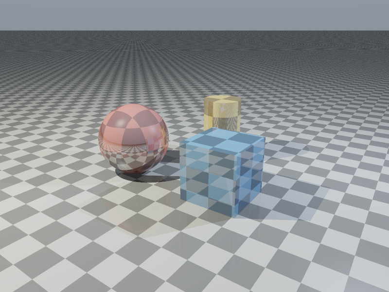
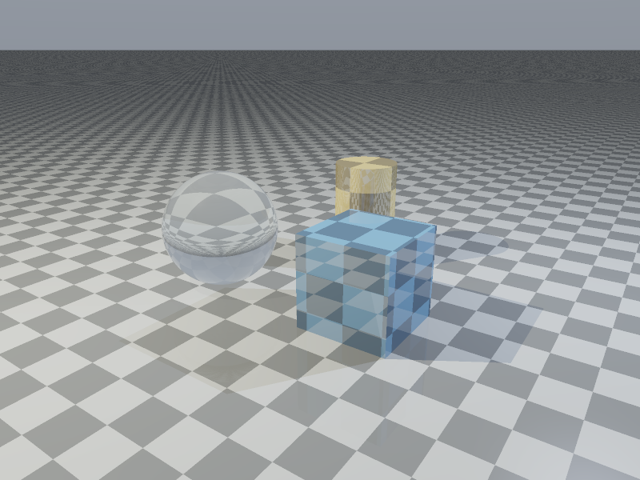
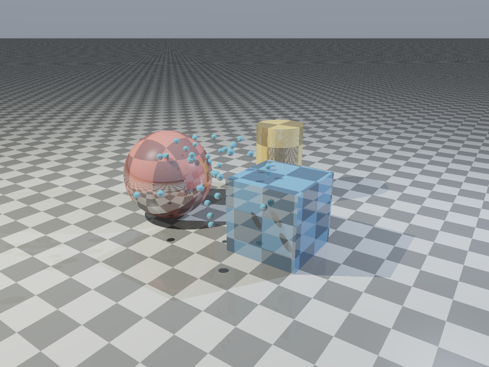
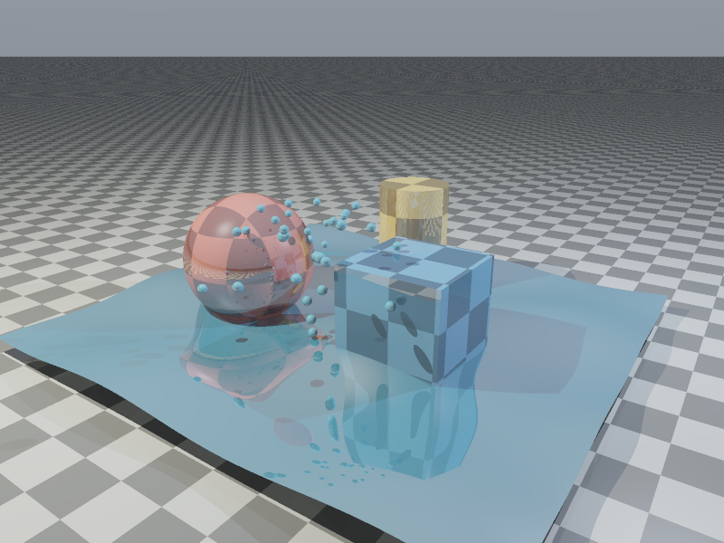

# RT: Rust Ray Tracer

A CPU ray tracer written in Rust using only the standard library. It renders spheres, cubes, planes, and capped cylinders to portable PPM images, with configurable cameras, lighting, shadows, and optional procedural effects.



## Features

- Analytical intersections for spheres, axis-aligned cubes, infinite planes, and finite vertical cylinders, including both end caps.
- Point lights with adjustable brightness, ambient and diffuse shading, specular highlights, distance attenuation, and hard shadows.
- Recursive reflections and dielectric refraction using Snell's law, Schlick's Fresnel approximation, and total internal reflection.
- Procedural 3D checker textures on the four basic object types.
- A deterministic fountain of 32 particles with ballistic motion and a time-dependent water height field with analytical surface normals.
- Movable look-at camera, adjustable target and field of view, grid supersampling, and configurable CPU workers.
- Linear color accumulation, Reinhard tone mapping, approximate gamma 2.2 display encoding, and buffered ASCII P3 output.
- Four reproducible 800×600 scene images, plus PNG previews for viewing on GitHub.

The renderer has **no third-party Rust dependencies**, no GPU requirement, and no runtime asset downloads.

## Quick start

Requirements: Rust **1.85 or newer**, Cargo, and the native linker required by your Rust toolchain. Commands run from the repository root.

```sh
cargo build --release --locked
cargo run --release -- --scene all --textures --reflections --samples 2 --output output.ppm
```

Open `output.ppm` with an image viewer that supports PPM. The renderer writes PPM; the checked-in PNGs are lossless conversions of rendered output. Prefer `--output` when using Windows PowerShell, whose older versions can change the encoding of redirected stdout.

Start with a smaller image while adjusting a scene:

```sh
cargo run --release -- --scene all --width 320 --height 240 --output preview.ppm
```

Explore glass, particles, and water:

```sh
cargo run --release -- --scene all --textures --reflections --refractions --particles --fluids --time 0.4 --samples 2 --output effects.ppm
```

| Glass refraction | Ballistic particles | Water and particles |
| --- | --- | --- |
|  |  |  |

These previews enable textures and reflections. Glass also enables refractions; particles and water use `--time 0.4`. Each image uses `--scene all --samples 2` at the default resolution.

## Command-line options

Run `cargo run --release -- --help` for the complete help text.

| Option | Default | Behavior |
| --- | --- | --- |
| `--scene` | `sphere` | `sphere`, `cube-plane`, `all`, or `all-alt` |
| `--width`, `--height` | `800`, `600` | Each 1–16,384; at most 16,777,216 pixels total |
| `--output`, `-o` | stdout | Destination P3 PPM file; parent directory must exist |
| `--brightness` | scene preset | Finite value 0–1,000; the second light in `all` remains 65% of this value |
| `--camera` | scene preset | Camera position as `x,y,z` |
| `--target` | scene preset | Look-at target as `x,y,z` |
| `--fov` | 48° or 50° | Vertical field of view: at least 1°, below 179° |
| `--textures`, `-t` | off | Enable material checker textures |
| `--reflections`, `-r` | off | Enable material reflections |
| `--refractions` | off | Make preset spheres glass; enable transmission in water if present |
| `--particles` | off | Add 32 small spheres following repeating ballistic trajectories |
| `--fluids` | off | Add a bounded procedural water surface |
| `--time` | `0` | Snapshot time in seconds, finite and between 0 and 1,000,000 |
| `--samples` | `1` | Samples **per axis**, 1–8; `2` casts 4 primary rays per pixel |
| `--threads` | logical CPU count, capped at 64 | Worker count, 1–64; at most one worker per image row |
| `--max-depth` | `5` | Secondary-ray bounce limit, 1–10 |
| `--help`, `-h` | — | Show help and exit |

Camera coordinates must be finite and within ±1,000,000. Coincident camera and target positions are rejected; looking vertically uses an alternate up axis. Invalid arguments and I/O failures return a nonzero exit code, with errors on stderr. Valid renders put only image data on stdout.

## Required scenes

The four PPM files in [scenes/](scenes/) are 800×600 renders with `--reflections --samples 2`. `all-alt` shares the geometry and lights of `all`, changing only the camera.

| Scene | Content | PPM | Preview |
| --- | --- | --- | --- |
| `sphere` | Red sphere and ground plane; brightness 5.5 | [sphere.ppm](scenes/sphere.ppm) | [PNG](docs/images/sphere.png) |
| `cube-plane` | Blue cube and plane; lower brightness of 3.0 | [cube-plane.ppm](scenes/cube-plane.ppm) | [PNG](docs/images/cube-plane.png) |
| `all` | One sphere, cube, cylinder, and plane | [all.ppm](scenes/all.ppm) | [PNG](docs/images/all.png) |
| `all-alt` | The same scene from another viewpoint | [all-alt.ppm](scenes/all-alt.ppm) | [PNG](docs/images/all-alt.png) |

For example, regenerate the alternate view with:

```sh
cargo run --release -- --scene all-alt --reflections --samples 2 --output scenes/all-alt.ppm
```

## Implementation

| Module | Responsibility |
| --- | --- |
| [math.rs](src/math.rs) | Vector arithmetic, rays, reflection, and refraction |
| [geometry.rs](src/geometry.rs) | Materials, textures, hit records, and primitive intersections |
| [camera.rs](src/camera.rs) | Validated camera basis and sample rays |
| [scene.rs](src/scene.rs) | Scene presets, lights, and effect placement |
| [effects.rs](src/effects.rs) | Particle trajectories and bounded wave intersection |
| [renderer.rs](src/renderer.rs) | Shading, secondary rays, worker partitioning, and PPM encoding |
| [cli.rs](src/cli.rs) | Argument parsing, limits, and help |
| [main.rs](src/main.rs) | Application setup, output routing, and error reporting |

Pixels are partitioned into disjoint row bands using scoped standard-library threads. Each worker writes to its own slice of an RGB buffer; the main thread serializes pixels in raster order. There are no shared pixel locks, and changing worker counts preserves output exactly. The RGB buffer uses three bytes per pixel (48 MiB at the configured maximum).

The intersection search scans every object, a deliberate choice for the small preset scenes. Cylinders and cubes retain outward normals even when rays originate inside them. The shader orients normals against incoming rays and offsets secondary-ray origins to reduce self-intersection artifacts. Light visibility stops at the light rather than treating objects behind it as occluders.

See [DOCUMENTATION.md](DOCUMENTATION.md) for object construction, material customization, brightness, camera controls, and effect examples.

## Performance and verification

A local measurement on **2026-10-07**, using Windows, Rust 1.88.0, and an AMD Ryzen 5 7600X (6 cores / 12 logical CPUs):

| Render | 1 worker | 12 workers |
| --- | --- | --- |
| 800×600 `all`, textures + reflections, `--samples 2` | 0.563 s | 0.126 s |

These are medians of five release-binary runs, including PPM encoding and stdout capture, excluding compilation. This workload measured about **4.5×** faster with 12 workers. Results depend on hardware, scene complexity, samples, and recursion depth; they are not a general speedup guarantee.

```sh
cargo fmt --all -- --check
cargo clippy --all-targets --locked -- -D warnings
cargo test --locked
cargo build --release --locked
```

The GitHub Actions workflow configures these checks for stable Rust on Windows, Linux, and macOS, and for Rust 1.85.0 on Linux. Hosted CI results require a push; local verification is recorded in [docs/VERIFICATION.md](docs/VERIFICATION.md).

## Scope and limitations

This is an educational Whitted-style ray tracer. Particles follow prescribed trajectories without collision simulation; water is a procedural animated height field, not a fluid dynamics solver. The water patch is an open surface without side walls or a closed volume. Wave intersections use a conservative march with a 256-step limit, which can miss sufficiently grazing intersections.

Refraction assumes air outside each dielectric and does not track nested media. Transparent shadows approximate straight-line transmission; the renderer does not simulate caustics, global illumination, dispersion, or volumetric absorption. Lighting attenuation is artistic, and gamma 2.2 encoding approximates display response. Cubes are axis-aligned, cylinders are vertical, and custom scenes are authored in Rust rather than loaded from a scene file. Supersampling reduces edge aliasing but does not filter distant checker textures.

There is no BVH, mesh import, GPU backend, interactive viewer, or native PNG encoder. Those are possible extensions rather than implemented features.
